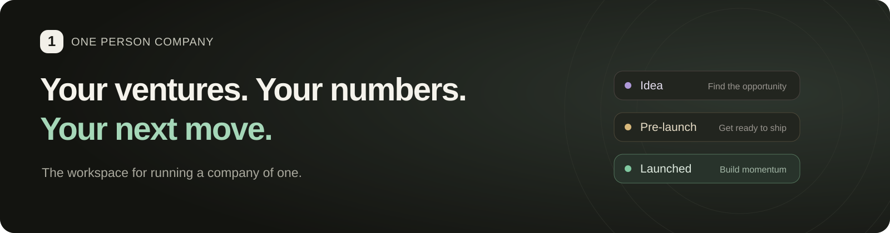
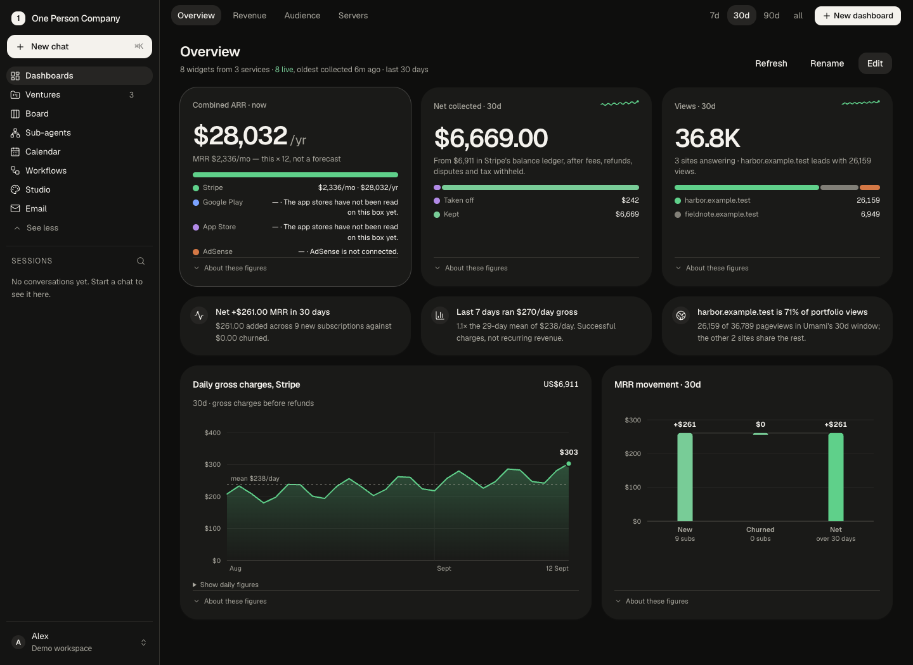
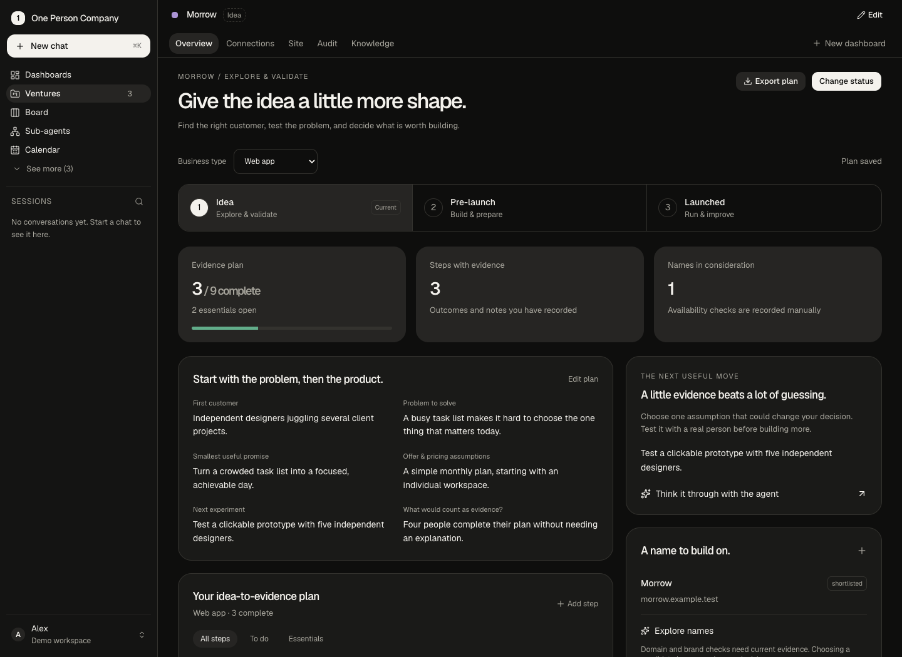
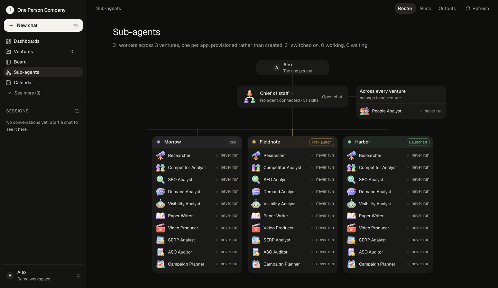

<p align="center">
  
</p>

<h1 align="center">One Person Company</h1>

<p align="center">
  <a href="https://github.com/tashfeenahmed/OnePersonCompany/actions/workflows/check.yml"></a>
  <a href="LICENSE"></a>
  <a href=".node-version"></a>
  
</p>

<p align="center">
  <b>A workspace for the person running the whole business.</b><br>
  Plan your next venture. Understand the ones you have. Put specialist agents to work.
</p>

<p align="center">
  <a href="#quick-start">Quick start</a> ·
  <a href="#see-it-in-action">Videos</a> ·
  <a href="#what-you-can-do">Features</a> ·
  <a href="#connect-your-stack">Integrations</a> ·
  <a href="#documentation">Documentation</a> ·
  <a href="CONTRIBUTING.md">Contribute</a>
</p>

https://github.com/user-attachments/assets/a579d27a-30f5-417d-91c0-e742222ab64f

One Person Company is a self-hosted workspace for solo founders and independent businesses. It brings together venture planning, revenue, analytics, infrastructure, work tracking, and AI assistance—so your next decision starts with the context already in front of you.

Connect the services you use, arrange the widgets that matter, and keep your operating history in a SQLite database on a machine you control. Start with a single idea or manage several businesses from the same workspace.



*Screenshots and recordings show the real application with fictional demo data. A new installation starts with your own empty portfolio; connected services supply the live numbers.*

## See it in action

Short screen recordings of the real application running on fictional demo data: one founder, six ventures. Press play on any of them.

<table>
  <tr>
    <td width="38%" valign="top"><h3>The whole business, briefly</h3>Combined yearly revenue across Stripe and both app stores, net collected, page views, MRR movement, users per venture, fleet health and portfolio margin on one page.</td>
    <td width="62%"><video src="https://github.com/user-attachments/assets/a579d27a-30f5-417d-91c0-e742222ab64f" controls muted playsinline width="600"></video></td>
  </tr>
  <tr>
    <td width="38%" valign="top"><h3>Ventures and the venture page</h3>Every venture with its stage and linked sources, the org chart, then one venture in depth: this week's focus, connections, the site's brand reading, a technical audit and the knowledge the agents work from.</td>
    <td width="62%"><video src="https://github.com/user-attachments/assets/df71ecf0-22e7-4814-bb06-0a2246781570" controls muted playsinline width="600"></video></td>
  </tr>
  <tr>
    <td width="38%" valign="top"><h3>The board</h3>Cards filed by you and by the agents, with urgency, due dates and the evidence behind each one. Filter to a single venture in one click.</td>
    <td width="62%"><video src="https://github.com/user-attachments/assets/bcf79fc2-6389-4f55-ac54-cc5c69cb13fa" controls muted playsinline width="600"></video></td>
  </tr>
  <tr>
    <td width="38%" valign="top"><h3>Chat with your Chief of Staff</h3>Ask what changed and what to do about it. Answers come with tables, the steps taken, a dispatched specialist and a drafted customer email.</td>
    <td width="62%"><video src="https://github.com/user-attachments/assets/30a072a1-3b8f-48dc-a670-583a2a765a71" controls muted playsinline width="600"></video></td>
  </tr>
  <tr>
    <td width="38%" valign="top"><h3>A team of specialists</h3>One set of workers per venture: researcher, competitor analyst, SEO, demand, visibility, SERP and store listing. See the roster, the run queue and a worker's own thread.</td>
    <td width="62%"><video src="https://github.com/user-attachments/assets/40191171-eec0-4c13-8617-b04c7a148422" controls muted playsinline width="600"></video></td>
  </tr>
  <tr>
    <td width="38%" valign="top"><h3>Reports you can read</h3>Finished runs become designed reports with charts and tables: an SEO review, a competitor table that flags what changed, and market research.</td>
    <td width="62%"><video src="https://github.com/user-attachments/assets/5d41242f-7bfb-4613-b810-43f49bd9d4cf" controls muted playsinline width="600"></video></td>
  </tr>
  <tr>
    <td width="38%" valign="top"><h3>Revenue and payments</h3>MRR, churn, payouts, app-store proceeds, failed payments, disputes and the money still on the floor, over 7 days, 30 days, 90 days or all time.</td>
    <td width="62%"><video src="https://github.com/user-attachments/assets/9cb17172-c867-413c-8d75-285357c2820b" controls muted playsinline width="600"></video></td>
  </tr>
  <tr>
    <td width="38%" valign="top"><h3>Search, SEO and analytics</h3>Google and Bing clicks and impressions per property, top queries and pages, page-two opportunities, audits, and privacy-friendly web analytics.</td>
    <td width="62%"><video src="https://github.com/user-attachments/assets/1846b6c5-9953-4916-b228-7b0111eebc17" controls muted playsinline width="600"></video></td>
  </tr>
  <tr>
    <td width="38%" valign="top"><h3>Studio</h3>Make on-brand image posts and short videos per venture, queue them for publishing, and let autopilot keep a steady cadence.</td>
    <td width="62%"><video src="https://github.com/user-attachments/assets/81cb3b90-6428-4cb5-a114-dd6be9e480e2" controls muted playsinline width="600"></video></td>
  </tr>
  <tr>
    <td width="38%" valign="top"><h3>Email</h3>One mail page: the inbox across ventures, triage with reasons, the commitments you made, drafts waiting for approval and nurture sequences.</td>
    <td width="62%"><video src="https://github.com/user-attachments/assets/2b04c0d1-5d5e-4184-aa38-675aba50cbaf" controls muted playsinline width="600"></video></td>
  </tr>
  <tr>
    <td width="38%" valign="top"><h3>Calendar and workflows</h3>Your week at a glance, and the nightly workflow that refreshes data, checks alerts, runs the specialists and proposes actions.</td>
    <td width="62%"><video src="https://github.com/user-attachments/assets/4e302bf8-435f-4459-8e3b-26c6b8db7f89" controls muted playsinline width="600"></video></td>
  </tr>
  <tr>
    <td width="38%" valign="top"><h3>Costs, servers and domains</h3>Where the money goes, model spend by project and key, server load and disks, and every domain with its renewal date.</td>
    <td width="62%"><video src="https://github.com/user-attachments/assets/0c0c116c-06a6-4252-acfe-b4bb5dfe9c9d" controls muted playsinline width="600"></video></td>
  </tr>
  <tr>
    <td width="38%" valign="top"><h3>Search, alerts and insights</h3>Find anything with ⌘K, review incidents and recoveries, read pace projections and anomalies, and clear the action inbox.</td>
    <td width="62%"><video src="https://github.com/user-attachments/assets/bf0cfc36-7b4e-41a5-a9bc-f14d20d690c1" controls muted playsinline width="600"></video></td>
  </tr>
  <tr>
    <td width="38%" valign="top"><h3>A venture before launch</h3>The pre-launch page: launch date, first-week plan, a checklist with evidence, and facts gathered from the repository and the store.</td>
    <td width="62%"><video src="https://github.com/user-attachments/assets/951aea3e-2a4a-47e2-8297-2e443ed9f4c2" controls muted playsinline width="600"></video></td>
  </tr>
  <tr>
    <td width="38%" valign="top"><h3>Mobile apps and users</h3>Downloads, installs, ratings and versions for iOS and Android, plus signups, active users and paying share across products.</td>
    <td width="62%"><video src="https://github.com/user-attachments/assets/c94edf43-2147-463c-88da-55850fe5d4ef" controls muted playsinline width="600"></video></td>
  </tr>
</table>

## What you can do

| Area | What it helps you do |
| --- | --- |
| **Venture dashboards** | Move between idea, pre-launch, and launched stages. Keep plans, evidence, checklists, and business performance together. |
| **Custom dashboards** | Arrange reusable widgets for revenue, traffic, costs, customers, domains, servers, and more. Save the views you actually use. |
| **Specialist agents** | Work with a Chief of Staff and specialists for research, competitors, SEO, writing, and other jobs. Give each venture its own context and instructions. |
| **Revenue and customers** | Follow subscriptions, collections, operating costs, app-store revenue, payment failures, and customer signals. Different currencies stay separate. |
| **Infrastructure and alerts** | Track servers, disks, containers, uptime, and domains. Configure persistent-problem alerts and keep incident recovery history. |
| **Work and momentum** | Customize board columns, record a personal work journal, track streaks, and review dormant ventures. |
| **Signals and projections** | Review anomalies and “at this pace” projections with their evidence. Import your own daily metrics through a shared data contract. |
| **Content and relationships** | Research, draft, create media, manage email, and prepare publishing work using the integrations and runtimes you connect. |

### From first idea to daily operations

The venture dashboard changes with the business. Switch stages whenever your plan changes; your checklist progress and saved dashboards stay with you.

| Idea | Pre-launch | Launched |
| --- | --- | --- |
| Define the customer and problem. Compare alternatives. Shortlist names and record your checks. Choose the next experiment. | Set the first version's scope. Work through launch essentials. Prepare support, your first audience, and the first-week plan. | Follow performance, review operating priorities, and record decisions. Archive completed reviews and start the next cycle. |



Checklists adapt to **web apps, mobile apps, desktop apps, websites, local shops, physical goods, and services**. Add your own steps and evidence. Custom metrics can support non-software businesses; native point-of-sale or inventory connectors are not implied.

### A small team of specialists, with your context

Keep research, product knowledge, instructions, and agent runs attached to the venture they belong to. Choose a supported model provider or local model runtime, and use the job and usage controls to put bounds on managed work.



Agents operate through scoped tools. Sensitive operations such as credential management, mail approval, and deployment have owner controls. See the [security model](docs/security.md) for the exact boundaries, including the difference between running agents as your own OS user and isolating them under a separate account.

## Quick start

**Requirements:** Git, npm, and **Node.js `>=24.18 <27`**. The version in [`.node-version`](.node-version) is used by CI. macOS and Linux have service-installation support; optional integrations may need additional tools.

```sh
git clone https://github.com/tashfeenahmed/OnePersonCompany.git
cd OnePersonCompany
npm run setup
npm run dev
```

Open **[http://127.0.0.1:5180](http://127.0.0.1:5180)**. The development launcher starts the UI and API together.

A fresh installation opens a guided setup:

1. **Name your workspace** and set an owner password.
2. **Add ventures** with their business type and stage, or start with an empty workspace.
3. **Select services**, download a blank ENV template, and paste credentials together. Individual fields and credential-file uploads are also available.
4. **Check access** and fix failed connections. Working services stay available across the workspace.
5. **Choose Hermes or OpenClaw** with an LLM provider, then review your starting dashboards.

Setup resumes after a reload. Existing workspaces keep their layout and open normally. After setup, manage details in Settings, Security, Ventures, and Integrations. See [onboarding and automatic setup](docs/onboarding.md) for connection matching and isolated testing.

You can use planning and work tracking before connecting any external account. Paid providers and services may charge for their own usage.

<details>
<summary><b>Run a production build</b></summary>

```sh
npm run build
npm start
```

Open **http://127.0.0.1:8787**. This serves the built client and API from one process. Keep that process running for scheduled collection and jobs.

For supervised startup, configuration, remote access, and recovery, see the [deployment guide](docs/deployment.md).

</details>

<details>
<summary><b>Ports, configuration, and troubleshooting</b></summary>

Defaults work without an environment file. To customize them, copy `server/.env.example` to `server/.env`.

| Setting | Default | Purpose |
| --- | --- | --- |
| `PORT` | `8787` | API and production UI port. |
| `OPC_BIND_HOST` | `127.0.0.1` | Listening interface; set `0.0.0.0` for LAN access and restrict the port with a firewall. |
| `OPC_ALLOWED_ORIGINS` | Empty | Additional exact browser origins, comma-separated, such as `http://dashboard.local:8787`. |
| `OPC_UI_PORT` | `5180` | Development UI port; must differ from `PORT`. |
| `OPC_DATA_DIR` | `./data` | Local data directory, resolved from `server/`. |
| `OPC_COLLECT_MINUTES` | `30` | Default collection interval; `0` disables scheduled collection. |

For LAN access, set an owner password in Settings → Security before enabling the listening interface, and permit the port only from your trusted network in the host firewall. Add the exact URL you will open to `OPC_ALLOWED_ORIGINS` so browser controls work from that address.

Run `npm run doctor` to check local readiness. If a port is occupied, stop the other process or set different ports in `server/.env`. If a widget has no data, check the integration's connection and collection status.

</details>

## Connect your stack

Integrations are optional. Connect the sources you need; each uses its own configuration, and collectors support individual schedules.

| Category | Examples |
| --- | --- |
| **Revenue and costs** | Stripe, App Store Connect, Google Play, AdSense, OpenAI, OpenRouter, Replicate |
| **Search and analytics** | Google Search Console, Bing Webmaster, Umami, Cloudflare, SearXNG |
| **Infrastructure** | Hetzner, SSH fleet monitoring, GitHub, domain registrars, workstation controls |
| **Communication** | Gmail, Resend, Telegram, Google Calendar |
| **Social and media** | Meta, Reddit, Hacker News, Pexels, Pixabay, supported publishing and media tools |
| **Your own data** | Product endpoints, app-user adapters, and daily metric imports |

A missing source stays visibly unmeasured. Charts and projections distinguish missing data from zero, and model-generated interpretation stays separate from collected figures.

Build custom integrations using the [adapter contract](deploy/adapters/README.md) and [daily metrics contract](docs/workspace-insights.md#daily-data-contract). Keep per-installation host and app mappings in [local inventory configuration](docs/local-inventory.md).

## Your data and your installation

- **One installation, one owner.** Each person runs their own copy. Multi-user accounts and team permissions are not part of this application.
- **Local storage.** History, workspace settings, and artifacts live in your configured data directory. Service credentials are encrypted in a local vault.
- **Connected services still receive requests.** External APIs and cloud models receive the information needed for the operations you choose. Local storage does not mean every operation runs offline.
- **Back up the full workspace.** Settings → Server manages backups. A layout/preferences export is useful, but it is not a complete backup.
- **Local access by default.** The API binds to loopback. Read the [deployment guide](docs/deployment.md) before adding remote access; authentication has specific origin requirements.

The vault key lives alongside the data. Protect that directory and its backups. The [security guide](docs/security.md) explains the model and its limits; [SECURITY.md](SECURITY.md) covers reporting vulnerabilities.

## Built to extend

```text
client/       React + Vite interface and reusable widgets
server/       Hono API, collectors, agent tools, and SQLite storage
shared/       Contracts and calculations shared by the client and server
deploy/       Service setup, isolation helpers, and adapter examples
docs/         Setup guides and extension documentation
```

The server runs TypeScript directly on Node. Add a source through an integration manifest, adapt it to shared contracts, and make it available to dashboards and venture views.

| Command | Purpose |
| --- | --- |
| `npm run setup` | Install client and server dependencies from lockfiles. |
| `npm run dev` | Start both development processes. |
| `npm run build` | Typecheck the server and build the client. |
| `npm test` | Run server and client tests with isolated test storage. |
| `npm run check` | Run tests, build, lint, catalog checks, and strict type checks. |
| `npm run doctor` | Check local runtime, configuration, storage, and tool readiness. |

## Documentation

- [Deployment, configuration, and backups](docs/deployment.md)
- [Security and data ownership](docs/security.md)
- [Venture stages and checklist extension points](docs/venture-journeys.md)
- [Insights, anomaly detection, journals, and custom metrics](docs/workspace-insights.md)
- [Local server and app inventory](docs/local-inventory.md)
- [Product and user adapters](deploy/adapters/README.md)
- [Shared modules](docs/shared-modules.md)
- [Server architecture and integration details](server/README.md)

## Contributing

Bug reports, documentation improvements, integrations, and thoughtful product improvements are welcome. Start with [CONTRIBUTING.md](CONTRIBUTING.md), or [open an issue](https://github.com/tashfeenahmed/OnePersonCompany/issues) with a reproducible example.

Use fictional data in fixtures, screenshots, and examples. Keep credentials, personal data, and private business information out of commits and issue reports.

## License

[MIT](LICENSE) · Copyright © 2026 One Person Company contributors.

Third-party services, trademarks, and bundled dependencies retain their respective terms and licenses.
